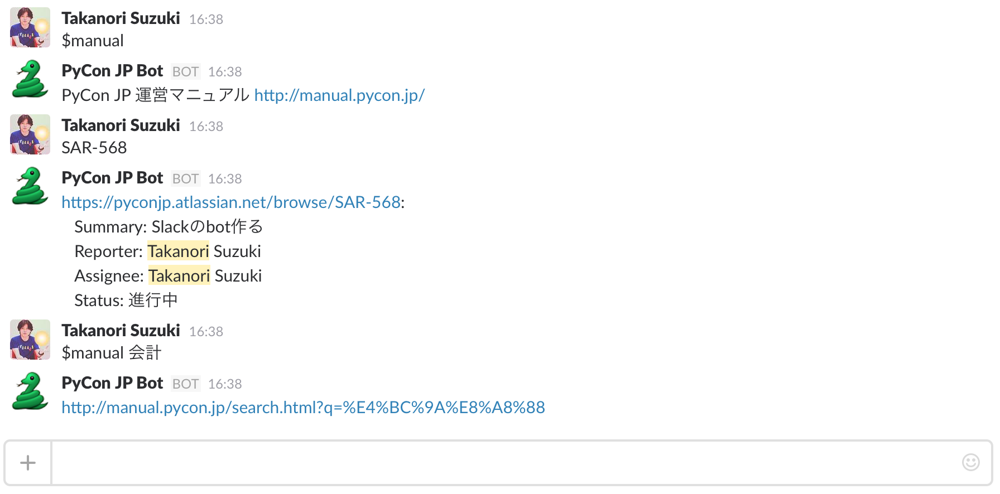

# PyCon JP Bot

* Chatbot for Slack of PyCon JP
* based on https://github.com/lins05/slackbot



## Commands

コマンドの一覧と簡単な説明

### term plugin

- `$term create (用語)`: 用語コマンドを作成する
- `$term drop (用語)`: 用語コマンドを消去する
- `$term search (キーワード)`: キーワードを含む用語コマンドの一覧を返す
- `$term list`: 用語コマンドの一覧を返す

- `$(用語)`: 用語コマンドに登録してある応答からランダムに一つ返す
- `$(用語) add (応答)`: 用語コマンドに応答を追加する
- `$(用語) del (応答)`: 用語コマンドから応答を削除する
- `$(用語) pop`: 用語コマンドの最後に登録した応答を削除する
- `$(用語) list`: 用語コマンドの応答一覧を返す
- `$(用語) search (キーワード)`: 用語コマンドのうちキーワードを含む応答一覧を返す

```
> $term create 酒
コマンド `$酒` を作成しました。
`$酒 add (レスポンス)` でレスポンスを追加できます
> $酒 add ビール
コマンド `$酒` に `ビール` を追加しました
> $酒 add ワイン
コマンド `$酒` に `ワイン` を追加しました
> $酒
ビール
```

- [term.py](https://github.com/pyconjp/pyconjpbot/blob/master/pyconjpbot/plugins/term.py)

### plusplus plugin

- `名前++`: 指定された名前に +1 カウントする(感謝を伝えるインクリメント)
- `名前--`: 指定された名前に -1 カウントする
- `$pluplus search (キーワード)`: 名前にキーワードを含む一覧を返す
- `$pluplus delete (名前)`: カウントを削除する(カウント10未満のみ)
- `$pluplus rename (変更前) (変更後)`: カウントする名前を変更する
- `$pluplus merge (統合元) (統合先)`: 2つの名前のカウントを統合先の名前にまとめる

- [plusplus.py](https://github.com/pyconjp/pyconjpbot/blob/master/pyconjpbot/plugins/plusplus.py)

### Google drive plugin

- `$drive [options] keywords`: 指定されたキーワードで Google ドライブを検索する
- `$drive db update`: 検索用のフォルダ情報を更新する
- `$drive db refresh`: 検索用のフォルダ情報を再構築する
- `$drive help`: drive コマンドのヘルプを表示

```
$drive [-n] [-l LIMIT] [-a | -f FOLDER] [-t TYPE] keywords...`

オプション引数:

  -n, --name            ファイル名のみを検索対象にする(未指定時は全文検索)
  -l LIMIT, --limit LIMIT
                        結果の最大件数を指定する(default: 10)
  -f FOLDER, --folder FOLDER
                        検索対象のフォルダーを指定する(default: 2016)
  -t TYPE, --type TYPE  検索対象のファイル種別を指定する
```

- [googledrive.py](https://github.com/pyconjp/pyconjpbot/blob/master/pyconjpbot/google_plugins/googledrive.py)

### manual plugin

- `$manual`: マニュアルのURLを返す
- `$manual keywords`: キーワードでマニュアルを検索するURLを返す
- `$manual help`: manual コマンドのヘルプを表示
- [manual.py](https://github.com/pyconjp/pyconjpbot/blob/master/pyconjpbot/plugins/manual.py)

### jira plugin

- `SAR-123`: JIRAのissueの情報を返す
- `$jira search keywords` `$jira 検索 keywords`: 指定されたキーワードで検索(オープンのみ)
- `$jira allsearch keywords` `$jira 全検索 keywords`: 指定されたキーワードで検索(全ステータス)
- `$jira assignee user` `$jira 担当 user`: 指定されたユーザーが担当しているissueを返す
- `$jira filter` `$jira フィルター`: フィルターの一覧を返す
- [jira.py](https://github.com/pyconjp/pyconjpbot/blob/master/pyconjpbot/plugins/jira.py)

```
$jira 検索 [-p PROJECT] [-c COMPONENT] [-l LABEL] [-s] [keywords ...]
$jira 全検索 [-p PROJECT] [-c COMPONENT] [-l LABEL] [-s] [keywords ...]

オプション引数:
  -p PROJECT, --project PROJECT
                        検索対象のプロジェクトを指定する(default: SAR)
  -c COMPONENT, --component COMPONENT
                        検索対象のコンポーネントを指定する
  -l LABEL, --label LABEL
                        検索対象のラベルを指定する
  -s, --summary         要約(タイトル)のみを検索対象にする(未指定時は全文検索)
```

### wikipedia plugin

- `$wikipedia keywords`: 指定されたキーワードの Wikipedia ページの情報を返す
- `$wikipedia -en keywords`: 指定された言語(en等)の Wikipedia ページの情報を返す
- `$wikipedia help`: wikipedia コマンドのヘルプを表示
- [wikipedia.py](https://github.com/pyconjp/pyconjpbot/blob/master/pyconjpbot/plugins/wikipedia.py)

### calc plugin

- 以下の様な数式の計算結果を返す

```
1 + 1
100 * 100
1 / 10
sqrt(2)
```

- [calc.py](https://github.com/pyconjp/pyconjpbot/blob/master/pyconjpbot/plugins/calc.py)

### reaction plugin

- 任意のキーワードに対して emoji でのリアクションを返す
- [reaction.py](https://github.com/pyconjp/pyconjpbot/blob/master/pyconjpbot/plugins/reaction.py)

### greeting plugin

- あいさつを返す

```
takanory: おはよう
BOT: @takanory おはようございます
```

- [greeting.py](https://github.com/pyconjp/pyconjpbot/blob/master/pyconjpbot/plugins/greeting.py)

### translator plugin

- `$translate python`, `$翻訳 python`: 指定した文字列を日本語に翻訳
- `$translate へび`, `$翻訳 蛇`: 指定した文字列を英語に翻訳
- `$translate -ru へび` `$翻訳 -ru へび`: 指定した言語(ru等)に翻訳
- `$translate list` `$翻訳 リスト`: 使用できる言語の一覧を返す

- [translator.py](https://github.com/pyconjp/pyconjpbot/blob/master/pyconjpbot/plugins/translator.py)
- Powered by [Microsoft Translator API](https://www.microsoft.com/en-us/translator/getstarted.aspx "Getting Started with Microsoft Translator")

### weather plugin

- `$weather` `$天気`: 東京の天気予報を返す
- `$weather 釧路` `$天気 釧路`: 指定した地域の天気予報を返す
- `$weather list` `$天気 list`: 指定可能な地域の一覧を返す
- [weather.py](https://github.com/pyconjp/pyconjpbot/blob/master/pyconjpbot/plugins/weather.py)

### misc plugin

- `$help`: ヘルプへのリンクを返す
- `$shuffle spam ham eggs`: 指定された単語をシャッフルした結果を返す
- `$choice spam ham eggs`: 指定された単語から一つをランダムに選んで返す
- `$ping`: 応答(pong)を返す
- `$version`: バージョン情報を返す
- `$random`: チャンネルにいるメンバーからランダムに一人を選ぶ
- [misc.py](https://github.com/pyconjp/pyconjpbot/blob/master/pyconjpbot/plugins/misc.py)

## How to build

```
$ git clone git@github.com:pyconjp/pyconjpbot.git
$ cd pyconjpbot
$ virtualenv -p python3.5 env
$ . env/bin/activate
(env)$ pip install -r requirements.txt
(env)$ cp slackbot_settings.py.sample slackbot_settings.py
(env)$ vi slackbot_settings.py
(env)$ python run.py
```
