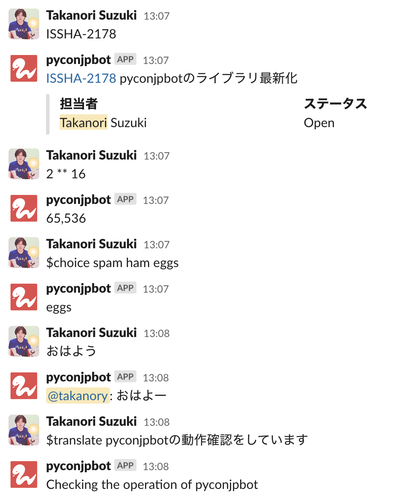

# PyCon JP Bot

Chatbot for Slack of PyCon JP



## Commands

コマンドの一覧と簡単な説明

### misc plugin

- `$helps`: ヘルプへのリンクを返す
- `$shuffle spam ham eggs`: 指定された単語をシャッフルした結果を返す
- `$choice spam ham eggs`: 指定された単語から一つをランダムに選んで返す

### manual plugin

- `$manual`: マニュアルのURLを返す
- `$manual keywords`: キーワードでマニュアルを検索するURLを返す
- `$manual help`: manual コマンドのヘルプを表示

### jira plugin

- `SAR-123`: JIRAのissueの情報を返す
- `$jira search keywords`: 指定したキーワードでJIRAを検索した結果を返す
- `$jira assignee keywords`: 指定されたユーザーが担当しているissueを返す

## How to build

```
$ git clone git@github.com:pyconjp/pyconjpbot.git
$ cd pyconjpbot
$ virtualenv -p python3.5 env
$ . env/bin/activate
(env)$ pip install -r requirements.txt
(env)$ cp slackbot_settings.py.sample slackbot_settings.py
(env)$ vi slackbot_settings.py
(env)$ python run.py
```

